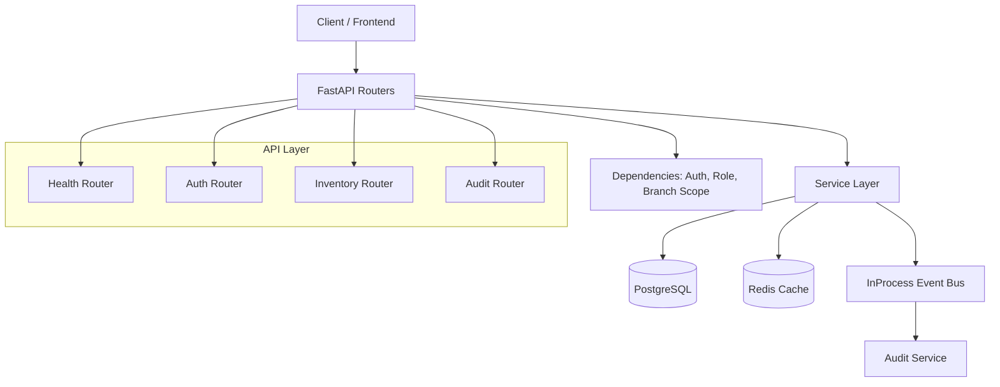

# ERP Backend Documentation Index

Use this page as the primary entrypoint for all project docs.

## Reading Order

1. [System Overview](01_SYSTEM_OVERVIEW.md)
2. [API and Runtime Flows](02_API_AND_RUNTIME_FLOWS.md)
3. [Database and Migrations](03_DATABASE_AND_MIGRATIONS.md)
4. [Operations, Testing, and Handoff](04_OPERATIONS_TESTING_AND_HANDOFF.md)
5. [UI Design System](05_UI_DESIGN_SYSTEM.md)

## What Each Document Covers

- [01_SYSTEM_OVERVIEW.md](01_SYSTEM_OVERVIEW.md)
  - Milestone status.
  - Architectural layering.
  - File map by responsibility.
  - Current known gaps and immediate next step.

- [02_API_AND_RUNTIME_FLOWS.md](02_API_AND_RUNTIME_FLOWS.md)
  - Endpoint-by-endpoint behavior.
  - Dependency and authorization flow.
  - Inventory stock cache behavior.
  - Event bus workflow.

- [03_DATABASE_AND_MIGRATIONS.md](03_DATABASE_AND_MIGRATIONS.md)
  - Migration timeline and schema evolution.
  - Table purpose and relationships.
  - Indexing and data integrity notes.
  - Seed behavior and migration workflow.

- [04_OPERATIONS_TESTING_AND_HANDOFF.md](04_OPERATIONS_TESTING_AND_HANDOFF.md)
  - Local runbook and smoke checks.
  - Test inventory.
  - Security notes.
  - Feature wiring status and handoff block.

## Week 11 Frontend Artifact

- Inventory + POS UI app: ../erp-web
- Frontend runbook: ../erp-web/README.md

- [05_UI_DESIGN_SYSTEM.md](05_UI_DESIGN_SYSTEM.md)
  - Mandatory blue-and-white minimalist visual direction.
  - Palette, typography, spacing, component, and motion rules.
  - Compliance checklist for all new and updated UI.

- [ui/component_template.html](ui/component_template.html)
  - Reusable navbar/sidebar/cards/buttons HTML scaffold.
  - Ready starter for new pages using the required design system.

- [ui/component_template.react.md](ui/component_template.react.md)
  - React + Tailwind version of the same reusable scaffold.
  - Includes usage notes and implementation constraints.

- [ui/ICON_SCALE.md](ui/ICON_SCALE.md)
  - Shared icon sizing rules for topbar, navigation, and meta/action contexts.
  - Standardizes outlined icon scale across all UIs.

## Quick Architecture Diagram



## Week 11 Data Flow Diagram

```mermaid
flowchart LR
    Req[HTTP Request] --> Router[Inventory Router]
    Router --> Auth[Bearer Auth and Current User]
    Auth --> Branch[Resolve Current Branch]
    Branch --> Role[Role Guard]
    Role --> Service[Inventory Service]

    Service --> DBWrite[(PostgreSQL Write/Read)]
    Service --> CacheRead[(Redis Read)]
    Service --> EventBus[In-Process Event Bus]
    EventBus --> AuditWrite[(Append-Only Audit Log)]
    EventBus --> CacheInvalidate[(Redis Invalidate)]

    DBWrite --> Response[HTTP Response]
    CacheRead --> Response
    CacheInvalidate --> Response

    subgraph Product CRUD
      P1[POST or PUT or DELETE /inventory/products]
      P2[Branch-scoped Product Query]
      P3[Publish inventory.write.v1]
    end

    subgraph Stock Movement
      M1[POST /inventory/movements]
      M2[Insert StockMovement Row]
      M3[Publish inventory.write.v1]
      M4[Invalidate Branch Stock Cache]
    end

    Router --> P1
    Service --> P2
    Service --> P3
    Router --> M1
    Service --> M2
    Service --> M3
    EventBus --> M4

    subgraph POS Sales
      S1[POST /sales]
      S2[Create Sale and Line Items]
      S3[Append Sale Stock Movements]
      S4[Publish inventory.write.v1 as sale.create]
      S5[GET /sales/{id}/receipt]
      S6[GET /sales/summary/daily]
    end

    Router --> S1
    Service --> S2
    Service --> S3
    Service --> S4
    Router --> S5
    Router --> S6
```

## Current Implementation Snapshot

- Weeks completed: 1 through 11.
- Core implemented: foundation, auth/RBAC, inventory schema and APIs, immutable audit/event flow, integration hardening, observability instrumentation/export, monitoring assets, POS sales backend + frontend flow, and POS reversal backend flows (void/refund).
- Remaining gaps are documented in [01_SYSTEM_OVERVIEW.md](01_SYSTEM_OVERVIEW.md) and [04_OPERATIONS_TESTING_AND_HANDOFF.md](04_OPERATIONS_TESTING_AND_HANDOFF.md).

## Documentation Update Protocol

Use this protocol at the end of every stage implementation going forward.

1. Update milestone and status in [01_SYSTEM_OVERVIEW.md](01_SYSTEM_OVERVIEW.md).
2. Update endpoint/runtime behavior in [02_API_AND_RUNTIME_FLOWS.md](02_API_AND_RUNTIME_FLOWS.md).
3. Update schema/migration timeline in [03_DATABASE_AND_MIGRATIONS.md](03_DATABASE_AND_MIGRATIONS.md).
4. Update runbook, tests, and handoff block in [04_OPERATIONS_TESTING_AND_HANDOFF.md](04_OPERATIONS_TESTING_AND_HANDOFF.md).
5. Replace “Next target” and “Risk to watch” fields in handoff block with the next stage.
6. Record validation summary as: tests run, pass count, and known blockers.
